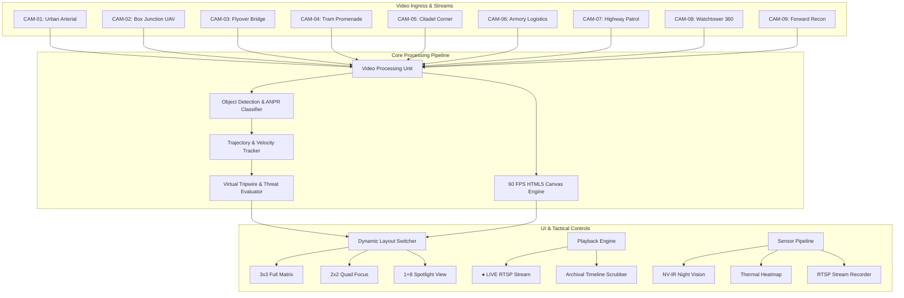

<div align="center">

# 👁️ SEEMADRISHTI AI
### Next-Gen Tactical Multi-Camera CCTV Surveillance & Threat Intelligence Command Matrix

[](https://react.dev/)
[](https://www.typescriptlang.org/)
[](https://tailwindcss.com/)
[](https://vitejs.dev/)
[](#-graphics--rendering-engine)
[](https://opensource.org/licenses/MIT)

<p align="center">
  <b>A high-performance, real-time 9-channel tactical video analytics and surveillance command matrix with hardware-accelerated computer vision overlays, automatic license plate recognition (ANPR), virtual tripwire breach detection, and dual-mode live/recorded telemetry scrubbing.</b>
</p>

[Key Features](#-key-features) • [System Architecture](#-system-architecture) • [Matrix Layouts](#-tactical-matrix-layouts) • [Quick Start](#-quick-start) • [Module Directory](#-project-structure) • [Security](#-security--privacy-policy)

---

```
┌─────────────────────────────────────────────────────────────────────────────────────────────┐
│ SEEMADRISHTI TACTICAL SURVEILLANCE MATRIX v4.2.0                    ● LIVE RTSP [9/9 ACTIVE]    │
├───────────────────────────────┬───────────────────────────────┬─────────────────────────────┤
│ [CAM-01] URBAN ARTERIAL       │ [CAM-02] AERIAL BOX JUNCTION  │ [CAM-03] FLYOVER JUNCTION   │
│ 🚗 MERCEDES E300 [22 MPH]     │ 🟨 YELLOW BOX CLEARANCE: 100% │ 🚌 BMTA BUS [ROUTE 504]     │
│ 🎯 ANPR: LD19 XKV             │ 🛸 MONOCHROME UAV OVERHEAD    │ 🏍️ MOTORBIKE SQUADRON       │
├───────────────────────────────┼───────────────────────────────┼─────────────────────────────┤
│ [CAM-04] TRAM PROMENADE       │ [CAM-05] CITADEL CORNER       │ [CAM-06] ARMORY LOGISTICS   │
│ 🚊 CITADIS TRAM [18 KM/H]     │ 🚐 TRANSIT VAN [26 KM/H]      │ 🛡️ SECURE VAULT ACCESS      │
│ 🚶 PEDESTRIAN [DWELL: 00:42]  │ 🎯 ANPR: EF18 UTY             │ 👥 BIOMETRIC VERIFICATION   │
├───────────────────────────────┼───────────────────────────────┼─────────────────────────────┤
│ [CAM-07] PATROL SPEED TRAP    │ [CAM-08] WATCHTOWER 360 APEX  │ [CAM-09] FORWARD RECON      │
│ ⚡ RADAR: 48 KM/H (POST-G)    │ 📡 360° RADAR SWEEP           │ 🚨 LASER TRIPWIRE BREACH    │
│ 🌙 NIGHT VISION IR ACTIVE     │ 🔭 HORIZON DRONE DETECT       │ 🟣 THERMAL IR HIGH-THREAT   │
└───────────────────────────────┴───────────────────────────────┴─────────────────────────────┘
```

</div>

---

## ⚡ Key Features

<table>
  <thead>
    <tr>
      <th width="30%">Feature Category</th>
      <th width="70%">Capabilities & Highlights</th>
    </tr>
  </thead>
  <tbody>
    <tr>
      <td><b>🎯 60 FPS Neural HUD</b></td>
      <td>
        • Real-time bounding boxes with class confidence percentages.<br/>
        • Dynamic velocity vectors and optical trajectory tracking.<br/>
        • Automatic Number Plate Recognition (<b>ANPR</b>) overlay engine.<br/>
        • Pulsating red laser tripwires with instantaneous breach alarms.
      </td>
    </tr>
    <tr>
      <td><b>🎛️ Dual-Mode Playback Engine</b></td>
      <td>
        • <b>● LIVE Mode</b>: Real-time multi-angle streaming simulation with live timestamping.<br/>
        • <b>RECORDED Mode</b>: Interactive timeline scrubber, pause/play, 1x/2x/4x high-speed playback, and incident bookmarking.
      </td>
    </tr>
    <tr>
      <td><b>🔬 Sensor Simulation Filters</b></td>
      <td>
        • <b>Night Vision (NV-IR)</b>: Green phosphor high-contrast spectral amplification.<br/>
        • <b>Thermal IR</b>: Ironbow/white-hot heat distribution palette simulation.<br/>
        • <b>Digital Zoom</b>: Up to 3.0x magnification with smooth viewport pan & snapshot capture.
      </td>
    </tr>
    <tr>
      <td><b>📊 Intelligence & Forensic Hub</b></td>
      <td>
        • <b>Incident Inspector</b>: Deep forensic triage with video bookmarking.<br/>
        • <b>Multi-Cam Stitching</b>: Wide-angle continuous perimeter reconstruction.<br/>
        • <b>Analytics Dashboard</b>: Radar risk vectors, anomaly heatmaps, and hourly vehicle flow density charts.<br/>
        • <b>Live Telemetry Gauges</b>: FPS counters, neural inference latency (ms), GPU compute load, and VRAM utilization.
      </td>
    </tr>
  </tbody>
</table>

---

## 📐 System Architecture



---

## 🔲 Tactical Matrix Layouts

SEEMADRISHTI allows operators to switch viewport layouts dynamically with one click:

| Layout Mode | Description | Best For |
| :--- | :--- | :--- |
| **`3x3 Matrix`** | Displays all 9 sector cameras simultaneously in synchronized grid cells. | High-level situational awareness across entire facility. |
| **`2x2 Quad View`** | Focuses on 4 high-resolution feeds with pagination controls. | Focused monitoring during medium-density operations. |
| **`Spotlight (1+8)`** | 1 large primary viewport (3 columns wide) with 8 scrollable side thumbnails. | Detailed incident investigation & forensic tracking. |

---

## 🚀 Quick Start

### Prerequisites
- **Node.js**: v18.0.0 or higher
- **Package Manager**: npm, yarn, pnpm, or bun

### 1. Clone & Install
```bash
# Clone the repository
git clone https://github.com/<your-username>/seemadrishti-ai-surveillance.git

# Navigate to the project root
cd seemadrishti-ai-surveillance

# Install dependencies
npm install
```

### 2. Launch Local Dev Server
```bash
npm run dev
```
Open [http://localhost:3000](http://localhost:3000) in your browser.

### 3. Production Build
```bash
npm run build
```
The optimized bundle will be created in the `dist/` directory.

---

## 📁 Project Structure

```text
seemadrishti-ai/
├── src/
│   ├── components/
│   │   ├── MatrixCameraCell.tsx     # Individual 60 FPS CCTV stream player & HUD engine
│   │   ├── TacticalMatrixView.tsx   # 3x3, 2x2, and Spotlight layout orchestrator
│   │   ├── CameraFeedCanvas.tsx     # Canvas rendering engine for optical flow vectors
│   │   ├── MultiCamStitchingView.tsx# Wide-angle panoramic multi-stream composite
│   │   ├── AnalyticsDashboard.tsx   # Traffic radar & anomaly density visualizers
│   │   ├── IncidentInspectorView.tsx# Deep forensic incident examination tool
│   │   ├── AlertsManagementView.tsx # Threat dispatch & triage manager
│   │   ├── SystemGauges.tsx         # GPU/VRAM hardware telemetry meters
│   │   ├── Header.tsx               # Top command bar with global record toggle
│   │   └── Sidebar.tsx              # Modular navigation between sub-systems
│   ├── data/
│   │   └── mockData.ts              # 9 pre-configured CCTV sectors & synthetic alerts
│   ├── utils/
│   │   ├── audioAlert.ts            # Dynamic tactical siren & breach sound synthesizer
│   │   └── recordingManager.ts      # Multi-channel RTSP recording session manager
│   ├── App.tsx                      # Root application lifecycle & state controller
│   ├── types.ts                     # TypeScript interfaces & schema definitions
│   └── main.tsx                     # React application entry point
├── public/                          # Static assets
├── vite.config.ts                   # Vite build configuration
└── package.json                     # Project manifest & dependencies
```

---

## ⌨️ Tactical Controls & Hotkeys

| Action | Control Button | Description |
| :--- | :---: | :--- |
| **Switch Live / Recorded** | `LIVE` / `RECORDED` | Toggle real-time feed vs archived timeline scrubber |
| **Toggle Night Vision** | `NV-IR` | Activates green phosphor spectral contrast filter |
| **Toggle Thermal Sensor** | `THERMAL` | Inverts colors and applies high-intensity thermal IR palette |
| **Digital Zoom** | `+` / `-` | Up to 3x digital zoom on active optical feed |
| **Capture Snapshot** | 📷 | Downloads full-resolution HUD snapshot as `.png` |
| **Sector Record** | ⏺ | Records current stream into the local tactical evidence vault |
| **Global Record All** | `REC ALL 9` | Starts concurrent recording across all 9 matrix channels |

---

## 🔒 Security & Privacy Policy

- **Zero Hardcoded Secrets**: This codebase contains **zero** private API keys, authentication tokens, passwords, or personal credentials.
- **Client-Side Simulation**: All video streams, license plates, operator profiles (`@surveillance.seemadrishti.gov`), and sensor telemetry use synthetic, privacy-safe simulation data.
- **Production-Ready Hygiene**: Environment templates (`.env.example`) contain only generic configuration variables.

---

## 📜 License

Distributed under the **MIT License**. See `LICENSE` for more information.

<div align="center">
  <sub>Built with ❤️ for advanced tactical computer vision, surveillance analytics, and defense technology dashboards.</sub>
</div>
