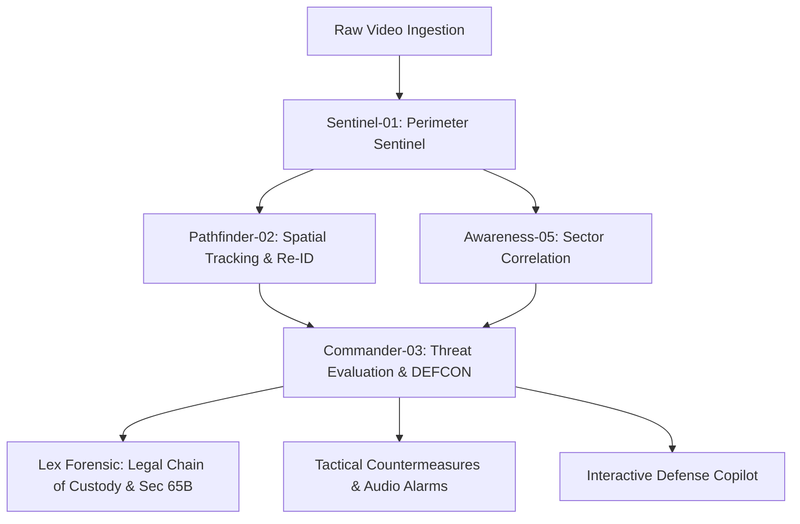

<div align="center">

# 👁️ SEEMADRISHTI AI (सीमा दृष्टि)
### Next-Gen Tactical Video Analytics & Autonomous Multi-Agent Defense Intelligence Platform
#### *Smart India Hackathon (SIH26187) — Ministry of Home Affairs*

[](https://react.dev/)
[](https://www.typescriptlang.org/)
[](https://python.org/)
[](https://github.com/ultralytics/ultralytics)
[](https://github.com/ifzhang/ByteTrack)
[](https://developer.mozilla.org/en-US/docs/Web/API/WebSockets_API)
[](https://indiankanoon.org/doc/1841315/)
[](https://opensource.org/licenses/MIT)

<p align="center">
  <b>A zero-cost, edge-deployable tactical defense platform transforming standard CCTV networks into an intelligent, autonomous threat-detection matrix with 60 FPS neural HUDs, a 5-Agent Autonomous AI Swarm, continuous cross-camera target journeys, Section 65B tamper-evident forensic custody, and real-time defense sirens.</b>
</p>

[Key Capabilities](#-key-capabilities) • [Autonomous AI Swarm](#-5-agent-autonomous-ai-swarm) • [System Architecture](#-system-architecture) • [Command Center Sections](#-command-center-sections) • [Quick Start](#-quick-start) • [Git & Contributing](#-contributing--git-identity)

---

```
┌─────────────────────────────────────────────────────────────────────────────────────────────────────────────┐
│ 👁️ SEEMADRISHTI DEFENSE COMMAND MATRIX v4.5                                    ● LIVE SECURE GATEWAY [ONLINE] │
├──────────────────────────────────────┬──────────────────────────────────────┬───────────────────────────────┤
│ [CAM-01] SECTOR ALPHA MAIN GATE      │ [CAM-02] SECTOR ALPHA EAST (MOBILE)  │ [CAM-03] ACCESS ROAD FLYOVER  │
│ 💻 LAPTOP / DESKTOP LIVE WEBCAM      │ 📱 SMARTPHONE QR STREAM INGESTION    │ 🚌 BMTA BUS [46.5 KM/H ← W]   │
│ 🚗 SUV #04 [42.5 KM/H → IN]          │ 🏃 PATROL #12 [4.8 KM/H → S-SE]      │ 🏍️ MOTORCYCLE #11 [61.8 KM/H] │
│ 🚨 WEAPON DETECTED: KNIFE // 91%     │ 🚨 OVERSPEED // 58.4 KM/H (LIMIT 50) │ 🚨 WRONG WAY // ID:18 (FLOW)  │
├──────────────────────────────────────┼──────────────────────────────────────┼───────────────────────────────┤
│ [CAM-04] PROMENADE & TRAMWAY         │ [CAM-05] CITADEL RAMPART JUNCTION    │ [CAM-06] WATCHTOWER APEX      │
│ 🚊 ELECTRIC TRAM #02 [28.4 KM/H]     │ 🚗 SEDAN #07 [44.2 KM/H ↗ NE]        │ 🛡️ SENTRY #02 [ACTIVE WATCH]  │
│ ⏳ LOITERING 24S // [UNATTENDED BAG] │ 🚨 PRONE CRAWLING // RISK 92 CRIT    │ 🚨 WEAPON DETECTED: RIFLE #06 │
├──────────────────────────────────────┼──────────────────────────────────────┼───────────────────────────────┤
│ [CAM-07] RIVERINE BORDER CROSSING    │ [CAM-08] HIGH-ALTITUDE OUTPOST       │ [CAM-09] FORWARD RECON HQ     │
│ 🚤 PATROL BOAT #01 [24.8 KM/H → SE]  │ 🛡️ ARMORED CARRIER #03 [32.5 KM/H]   │ 🚛 HEAVY TRUCK #19 [36.4 KM/H]│
│ 🚨 RESTRICTED WATERWAY BREACH #14    │ 🔭 SNIPER OUTPOST SENTRY #05         │ 🚨 LASER TRIPWIRE BREACH #28  │
└──────────────────────────────────────┴──────────────────────────────────────┴───────────────────────────────┘
```

</div>

---

## ⚡ Key Capabilities

### 1. 🎯 60 FPS Autonomous Defense Vision HUD
* **Real-Time Reticles**: High-contrast, color-coded tactical bounding boxes (Crimson for weapons/critical, Sky Blue for vehicles, Emerald for friendly/guards, Warm Amber for wildlife, Purple for luggage).
* **Speed & Flow Gauges**: Calibrated pixel-to-metric velocity calculation ($km/h$) with directional orientation indicators (`→ IN`, `← OUT`, `↗ NE`, `← W`).
* **Velocity Vectors & Trajectory Trails**: Polyline path history with smooth fading alpha trails illustrating target movement vectors and prediction cones.
* **Virtual Geofences & Laser Tripwires**: Point-in-Polygon restricted zones and ray-casting laser tripwires with instantaneous breach animations.

### 2. 🚨 Behavioral Threat & Violation Engine
* **🔫 Weapon Threat Identification**: Real-time detection of blades, firearms, rifles, pistols, and tactical knives with immediate escalation.
* **🚗 Vehicle Rule Violations**:
  * `WRONG_WAY_VEHICLE`: Vector dot product against designated corridor flow.
  * `VEHICLE_OVERSPEED`: Real-time velocity computation against sector limits ($> 50\text{ km/h}$).
  * `ILLEGAL_VEHICLE_STOP`: Dwell accumulation for stopped vehicles ($< 5\text{ px/s}$) in Keep-Clear buffer zones.
* **🏃 Suspicious Human Activity**:
  * `PRONE_CRAWLING_INFILTRATION`: Aspect ratio evaluation ($w/h > 1.6$) and low ground plane elevation.
  * `RAPID_SPRINT_EVASION`: Sprinting speed detection ($> 18\text{ km/h}$) towards border boundaries.
  * `PERSISTENT_LOITERING`: Dwell accumulator ($> 20\text{s}$) triggering automated patrol dispatch.
  * `UNATTENDED_PACKAGE`: Stationary backpacks and luggage in restricted zones ($> 15\text{s}$).

### 3. 🌐 Continuous Target Journey & Multi-Cam Stitching
* **Cross-Camera Target Journey**: Re-Identifies targets across non-overlapping camera fields of view using spatial-temporal transition graphs, velocity vectors, and HSV color signatures.
* **Panoramic Handover Corridors**: Visualizes active handover chains between cameras, transition timelines, and sector movement corridors.
* **Interactive SVG Network Map**: Displays live target positions projected onto geographical site topologies.

### 4. ⚖️ Section 65B Forensic Evidence Vault
* **Cryptographic Tamper-Proofing**: Generates SHA-256 digital hashes for every incident snapshot, audit log, and metadata payload.
* **Indian Evidence Act Compliance**: Formats forensic exports in compliance with Section 65B of the Indian Evidence Act, complete with examiner signatures, camera metadata, and verifiable timestamps.

### 5. 📲 Dual Live Hardware Ingestion
* **CAM-01 (Desktop / Laptop Webcam)**: Defaults safely to **OFF**; powers on on-demand via the `💻 DESKTOP CAM` button and streams directly into the real-time YOLOv8 detector.
* **CAM-02 (Mobile Phone Ingestion)**: Dynamic QR Code link allows any smartphone (iOS / Android) to broadcast its camera feed directly into Camera 2 over WebSocket at 25 FPS.

---

## 🤖 5-Agent Autonomous AI Swarm

Seemadrishti incorporates a multi-agent autonomous swarm operating with decentralized deliberation, consensus voting, and automated countermeasure dispatch:



1. **Sentinel-01 (Perimeter Sentinel & Vision Ingestion)**
   - Ingests raw frames, executes YOLOv8 inference, filters environmental noise, and maintains 60 FPS HUD overlay telemetry.
2. **Pathfinder-02 (Geospatial Tracking & Re-Identification)**
   - Tracks cross-camera targets, maps velocity vectors, calculates spatial handovers, and tracks target journeys across blind spots.
3. **Commander-03 (Tactical Threat Evaluation & DEFCON Escalation)**
   - Synthesizes risk scores (0–100), orchestrates swarm consensus, triggers automated defense sirens, and initiates countermeasure protocols.
4. **Awareness-05 (Situational Awareness & Sector Correlation)**
   - Discovers multi-sector threat patterns, calculates sector risk heatmaps, and correlates disparate camera incidents into single threat narratives.
5. **Lex Forensic (Legal & Evidentiary Chain-of-Custody)**
   - Generates SHA-256 cryptographic hashes, seals digital evidence, and certifies audit trails according to Section 65B of the Indian Evidence Act.

---

## 📐 System Architecture

```mermaid
flowchart TD
    subgraph Edge Ingestion
        C1[CAM-01: Laptop Webcam]
        C2[CAM-02: Mobile Smartphone Stream]
        C3to9[CAM-03 to CAM-09: RTSP / Network Cameras]
    end

    subgraph Computer Vision Core (Python 3.10+ / YOLOv8 / ByteTrack)
        YOLO[YOLOv8 Edge Detector]
        BYTE[ByteTrack Multi-Object Tracker]
        SUSP[Behavior & Threat Engine]
        INTRUS[Geofence & Tripwire Engine]
        RISK[Explainable Threat Scorer 0-100]
    end

    subgraph Defense Edge Gateway (Node.js / Express / SQLite)
        AUTH[JWT Role-Based Access Control]
        WS[WebSocket Gateway ws://0.0.0.0:3000/ws]
        REST[REST API /api/v1/...]
        SWARM[Autonomous Swarm Dispatcher]
        DB[(SQLite Persistent Storage)]
    end

    subgraph Tactical HUD & Command UI (React / TypeScript / Canvas)
        Canvas[60 FPS Canvas HUD Overlay]
        Matrix[Tactical 3x3 / 2x2 / Spotlight Grid]
        Stitch[Multi-Cam Handover & Journey Map]
        Audio[Web Audio Siren & Sonar Synthesizer]
        Copilot[Tactical AI Copilot & Help Bot]
    end

    C1 & C2 & C3to9 --> YOLO
    YOLO --> BYTE
    BYTE --> SUSP & INTRUS
    SUSP & INTRUS --> RISK
    RISK --> WS & REST
    AUTH --> REST & SWARM
    SWARM --> WS
    WS & REST --> Canvas & Matrix & Stitch & Audio & Copilot
    REST --> DB
```

---

## 🖥️ Command Center Sections

The platform features 22 dedicated tactical modules accessible from the defense navigation rail:

| Section | Route | Description |
| :--- | :--- | :--- |
| **Tactical Matrix** | `/` | 9-camera operational grid with 60 FPS canvas HUD overlays and controls. |
| **Multi-Cam Stitching** | `/stitching` | Threat corridor handovers, panoramic sequences, and camera transition timelines. |
| **Target Journey** | `/target-journey` | Cross-camera target search, speed telemetry, and SVG network topology. |
| **Autonomous Swarm** | `/agents` | Live 5-agent telemetry, workload decomposition, swarm consensus, and copilot reasoning. |
| **Radar Map** | `/radar-map` | 2D tactical radar screen with real-time target blips and bearing vectors. |
| **Threat Alerts** | `/threat-alerts` | High-priority security alarms with confidence meters and audio playback. |
| **Incident Inspector** | `/incident-inspector` | Video playback triage, frame-by-frame scrutiny, and incident escalation. |
| **Evidence Vault** | `/evidence-queue` | Tamper-proof evidence repository with Section 65B SHA-256 certificates. |
| **Historical Logs** | `/historical-logs` | Filterable database of past detections, camera handovers, and system events. |
| **Threat Heatmap** | `/heatmap` | Sector-wise risk intensity maps and spatial incident density visualizations. |
| **Mission Control** | `/mission-control` | High-level DEFCON status, system alerts, and quick tactical actions. |
| **Edge Node CLI** | `/terminal` | Low-latency tactical shell for diagnostic commands and node control. |
| **Defense Sandbox** | `/sandbox` | Synthetic threat scenario generator and algorithm stress-testing lab. |
| **Stream Diagnostics** | `/diagnostics` | Real-time frame latency, packet jitter, and hardware utilization gauges. |
| **Camera Fleet** | `/cameras` | IP camera provisioning, RTSP endpoint configuration, and stream status. |
| **Calibration** | `/calibration` | Interactive polygon geofence and tripwire zone drawing tool. |
| **Access Control** | `/users` | Defense role management (Commander, Admin, AI Analyst, Patrol Officer). |

---

## 🚀 Quick Start

### Prerequisites
- **Node.js**: v18.0.0 or higher (v20+ recommended)
- **Python**: v3.10 or higher (tested with Python 3.13)

### 1. Installation
```bash
# Clone the repository
git clone https://github.com/mukteshwar845/SEEMADRISHTI.git

# Navigate to the project root
cd SEEMADRISHTI

# Install frontend and server dependencies
npm install
```

### 2. Launch the Defense Command Center
```bash
# Starts Express Edge Gateway, WebSocket Server, Python CV processor, and Vite UI
npm run dev
```
Open **[http://localhost:3000](http://localhost:3000)** in your browser.

### 3. Verify & Run Test Suites
```bash
# Type check and lint
npm run lint

# Run all backend test suites (Database, Auth, Cryptography, WebSocket, AI)
npm run test:backend
```

### 4. (Optional) Run Python Edge Computer Vision Directly
```bash
# Install Python dependencies
pip install -r cv_service/requirements.txt

# Run comprehensive 8-engine AI self-diagnostic suite
python cv_service/tools/verify_all_ai.py

# Launch standalone camera detection service
python cv_service/main.py --source 0 --camera-id cam-01
```

---

## 👥 Contributing & Git Identity

To ensure your commits appear with your GitHub profile avatar and link to your username:

```bash
# Set your GitHub username
git config --global user.name "YourGitHubUsername"

# If you have "Keep my email addresses private" enabled on GitHub:
# Use your noreply email from https://github.com/settings/emails:
git config --global user.email "ID+YourUsername@users.noreply.github.com"

# Otherwise, use your primary GitHub email:
git config --global user.email "your-email@example.com"
```

---

## 🛡️ License & Acknowledgements

Developed for **Smart India Hackathon (SIH26187)** under the **Ministry of Home Affairs**.

* **Repository**: [https://github.com/mukteshwar845/SEEMADRISHTI](https://github.com/mukteshwar845/SEEMADRISHTI)
* **Lead Maintainer**: [mukteshwar845](https://github.com/mukteshwar845)
* **License**: [MIT License](LICENSE)
