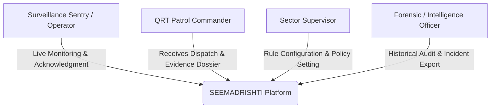
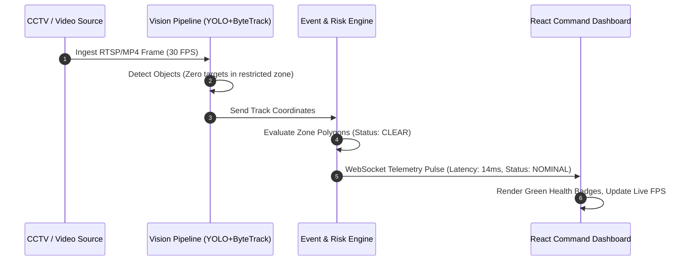
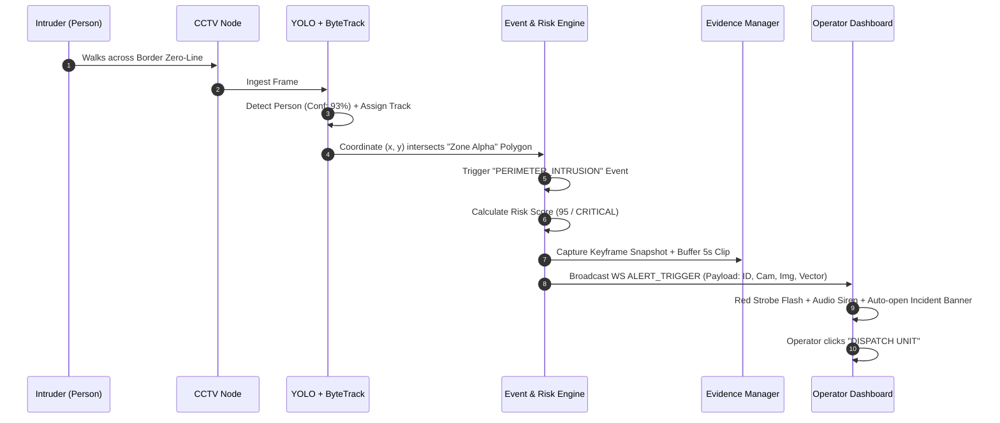
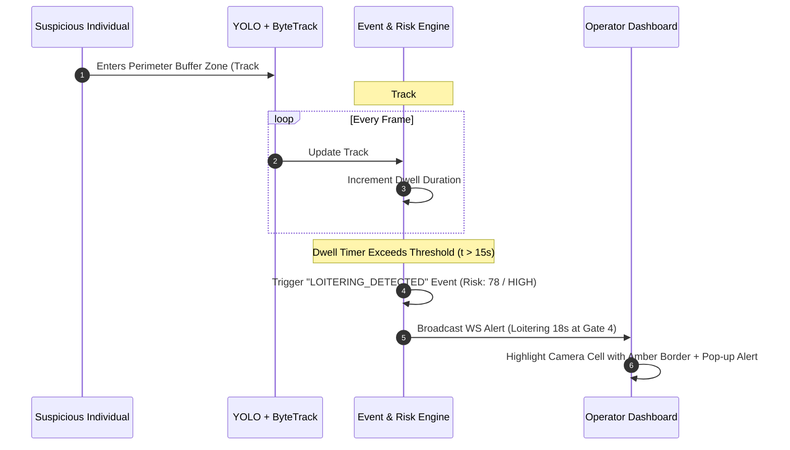
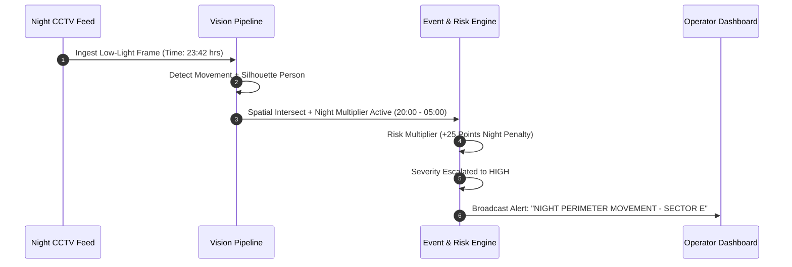
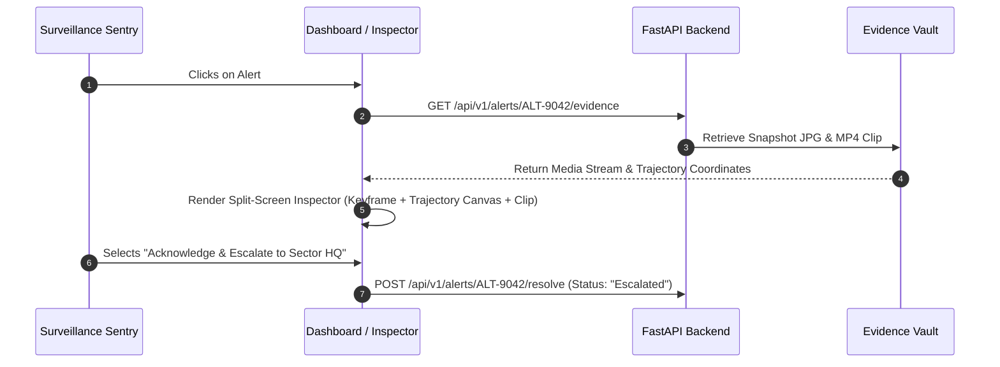
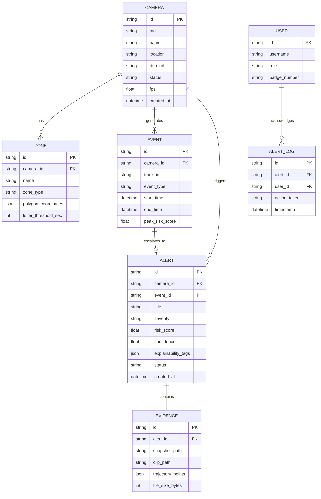
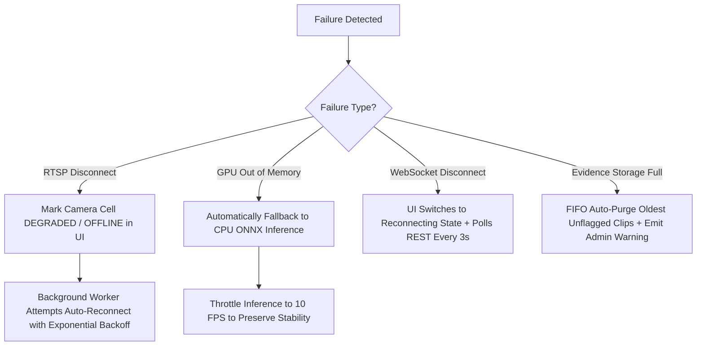

# PRODUCT REQUIREMENTS DOCUMENT (PRD)

**PROJECT NAME:** SEEMADRISHTI AI  
**TEAM NAME:** IQ100  
**PROBLEM STATEMENT ID:** SIH26187  
**PROBLEM STATEMENT TITLE:** AI-Based Intelligent Video Analytics Platform for Border Surveillance using existing CCTV Infrastructure  
**MINISTRY:** Ministry of Home Affairs (MHA)  
**THEME:** Smart Automation  
**CATEGORY:** Software  
**VERSION:** 1.0.0-SIH-STABLE  
**DOCUMENT STATUS:** FINAL / SINGLE SOURCE OF TRUTH  
**DATE:** August 2026 (SIH 2026 Implementation Cycle)  

---

## TABLE OF CONTENTS
1. [Product Vision](#1-product-vision)
2. [Problem Definition](#2-problem-definition)
3. [Product Goals](#3-product-goals)
4. [Target Users](#4-target-users)
5. [Core User Journeys](#5-core-user-journeys)
6. [Feature Requirements Matrix](#6-feature-requirements-matrix)
7. [P0 Feature Specifications](#7-p0-feature-specifications)
8. [AI / Computer Vision Pipeline Requirements](#8-ai--computer-vision-pipeline-requirements)
9. [Event Intelligence Engine](#9-event-intelligence-engine)
10. [Explainable Risk Scoring Engine](#10-explainable-risk-scoring-engine)
11. [System Architecture](#11-system-architecture)
12. [Frontend Integration Requirements](#12-frontend-integration-requirements)
13. [Backend API Specifications](#13-backend-api-specifications)
14. [Database & Persistence Schema](#14-database--persistence-schema)
15. [Evidence Capture & NVR Storage System](#15-evidence-capture--nvr-storage-system)
16. [Performance, Latency & Real-Time Benchmarks](#16-performance-latency--real-time-benchmarks)
17. [Dataset Strategy & Scenario Coverage](#17-dataset-strategy--scenario-coverage)
18. [Testing & Quality Assurance Strategy](#18-testing--quality-assurance-strategy)
19. [Failure Modes & Graceful Degradation](#19-failure-modes--graceful-degradation)
20. [Security, Privacy & Data Integrity](#20-security-privacy--data-integrity)
21. [Scalability & Migration Path](#21-scalability--migration-path)
22. [SIH Problem Statement Mapping](#22-sih-problem-statement-mapping)
23. [Competitive Differentiation & Defensibility](#23-competitive-differentiation--defensibility)
24. [SIH Live Demonstration Plan (3-Minute Script)](#24-sih-live-demonstration-plan-3-minute-script)
25. [11-Day SIH Development Roadmap](#25-11-day-sih-development-roadmap)
26. [Strict Definition of Done (DoD)](#26-strict-definition-of-done-dod)
27. [Explicit Non-Goals ("What We Will NOT Build")](#27-explicit-non-goals-what-we-will-not-build)
28. [Executive Summary & Core Takeaways](#28-executive-summary--core-takeaways)

---

## 1. PRODUCT VISION

### One-Line Product Vision
An intelligent, camera-agnostic software layer that transforms existing IP-CCTV border infrastructure into a proactive, explainable, and real-time perimeter threat intelligence system.

### Two-Line Product Description
SEEMADRISHTI AI retrofits existing legacy border surveillance cameras via standard RTSP/ONVIF streams, executing real-time computer vision detection, multi-object spatial tracking, virtual perimeter breach evaluation, and automated evidence package generation without requiring rip-and-replace hardware upgrades.

### Core Mission
To alleviate visual cognitive fatigue across border surveillance operators by filtering continuous raw video into prioritized, explainable, and actionable security events backed by auditable evidence dossiers.

### Problem Being Solved
Border Outposts (BOPs) and Sector Command Centers operate dozens of live CCTV cameras simultaneously. Human operators suffer severe attention degradation during long monitoring shifts, leading to undetected perimeter breaches, delayed threat dispatch, and retrospective forensic reviews rather than proactive real-time deterrence.

### Why The Problem Matters
National border integrity relies on zero-second situational awareness. A missed intruder crossing a riverine corridor, mountain defile, or fenced perimeter creates strategic vulnerabilities. Existing hardware-based "smart camera" replacements cost millions in taxpayer funding and face lengthy procurement delays. SEEMADRISHTI solves this purely in software on commercial off-the-shelf (COTS) edge workstations.

### Target Users
- Border Security Force (BSF) Outpost Sentry & Operators
- Quick Reaction Team (QRT) Dispatch Commanders
- Sector Command Center Surveillance Supervisors
- Tactical Intelligence & Forensic Review Officers

### Primary Use Cases
1. **Perimeter Virtual Tripwire Breach:** Detecting unauthorized human/vehicle crossing across designated geofenced border lines.
2. **Buffer Zone Loitering:** Detecting suspicious stationary presence or prolonged reconnaissance near sensitive installations.
3. **Low-Light / Night Activity:** Surfacing subtle movements in low-contrast environments where human eyes miss anomalous motion.
4. **Instant Evidence Verification:** Providing one-click video clips, trajectory vectors, and spatial bounding boxes to validate alerts before QRT mobilization.

### Expected Real-World Outcome
Reduction in human operator missed-detection rate, sub-500ms automated threat alerting, and complete evidence preservation for post-incident auditability.

---

## 2. PROBLEM DEFINITION

### What Existing CCTV Systems Can Do
- Continuous 24/7 video capture at 1080p / 4K resolutions.
- RTSP / ONVIF video streaming over local local-area networks (LAN) or optical fiber.
- Passive Network Video Recording (NVR) to local hard drives.
- Basic pixel-change motion detection (which triggers false alarms on foliage, rain, birds, and lighting shifts).

### What Existing CCTV Systems Cannot Do Effectively
- Discriminate between benign environmental movement (windblown trees, wildlife, shadows) and hostile tactical threats (crawling/walking humans, vehicles).
- Maintain persistent track identity across frame occlusions.
- Evaluate spatial contextual rules (e.g., distinguishing someone walking inside an authorized road vs. stepping into a restricted border zero-line).
- Calculate dwell duration and loitering persistence over time.
- Generate explainable risk scores explaining *why* an event is hazardous.

### Why Continuous Human Monitoring Is Difficult
- **Vigilance Decrement:** Empirical human factors research shows that human operator attention degrades significantly after 20 continuous minutes of multi-screen monitoring [TO BE VERIFIED with operational field metrics].
- **Screen Multiplexing:** Monitoring a 9-camera or 16-camera grid forces operators to divide saccadic eye fixations, leaving peripheral blind spots.
- **Visual Camouflage & Fatigue:** Night operations, fog, and thermal wash make detecting low-contrast movement cognitively exhausting.

### Why Real-Time Event Prioritization Matters
Instead of forcing an operator to stare at 9 continuous feeds, SEEMADRISHTI filters the noise and bubbles up only the top 1% of actionable, high-risk events, highlighting the specific camera, drawing trajectory bounding vectors, and sounding targeted low-latency alerts.

### Why Retrofitting Existing CCTV Infrastructure Matters
- India possesses thousands of kilometers of border perimeter equipped with legacy analog/IP cameras. Replacing them with proprietary "edge-AI smart cameras" requires massive capital expenditure, civil cabling overhauls, and vendor lock-in.
- SEEMADRISHTI operates as a pure software appliance: ingest RTSP/H.264/H.265 streams from any ONVIF-compliant camera, process centrally on an edge workstation (e.g., NVIDIA Jetson / RTX GPU), and display on the existing control room screens.

---

## 3. PRODUCT GOALS

### Primary Goals (P0 - SIH Core Deliverables)
1. **Real-Time Video Ingestion:** Multi-source ingestion supporting RTSP IP streams, local MP4 scenario test files, and live USB/webcams via OpenCV/FFmpeg.
2. **AI Object Detection:** Sub-30ms inference detecting `person` and `vehicle` classes using lightweight YOLO models.
3. **Persistent Object Tracking:** Multi-object tracking across frames with unique track IDs using ByteTrack to maintain continuous path history.
4. **Configurable Virtual Fencing:** Interactive UI polygon/line drawing allowing operators to define restricted zones and directional tripwires per camera.
5. **Event Intelligence Engine:** Rule-based conversion of raw detections into distinct security events:
   - *Intrusion Event* (Person/Vehicle crosses polygon boundary)
   - *Loitering Event* (Person remains inside zone exceeding $T_{\text{dwell}}$ seconds)
   - *Night Movement Event* (Low-light movement in restricted sector)
6. **Explainable Risk Scoring:** Deterministic, rule-based formula scoring threats from 0–100 with clear human-readable rationale tags.
7. **Real-Time Alert Dispatch:** Sub-second alert transmission to the dashboard via WebSockets with audible audio tones and visual strobe indications.
8. **Evidence Generation:** Automated snapshot extraction and 5–10 second MP4 video clip recording linked directly to the alert dossier.
9. **Interactive Command Dashboard:** High-contrast tactical React matrix displaying 9 live feeds, real-time overlays, telemetry gauges, and forensic logs.

### Secondary Goals (P1 - Should Have for Hackathon Polish)
1. **Camera Stream Health Monitoring:** Real-time diagnostics tracking FPS, frame drops, network jitter, and RTSP reconnect latency.
2. **Audio Siren Tone Synthesis:** Web Audio API multi-frequency sound alerts calibrated by threat severity (High / Medium / Low).
3. **CSV / PDF Dossier Export:** One-click download of incident tables and forensic audit logs.
4. **Daylight Field / Military Matrix Theme:** Dual high-contrast themes optimized for dark command bunkers and bright outdoor field tablets.

### Non-Goals (Strict SIH Boundaries - WILL NOT BUILD)
- ❌ Autonomous border-security weapon firing or kinetic actuation.
- ❌ Complex facial recognition against national databases (out of scope for perimeter COTS CCTV).
- ❌ Wide-area multi-camera cross-network re-identification (Re-ID across non-overlapping terrain requires extensive camera calibration).
- ❌ UAV / Drone physical flight control integration.
- ❌ Proprietary hardware manufacturing or custom ASIC board fabrication.
- ❌ Microservices overkill (Kubernetes, Kafka clusters, Apache Spark) during the 11-day hackathon.

---

## 4. TARGET USERS



### 1. Surveillance Sentry / Operator (BOP Level)
- **Need:** Immediate, unambiguous visual and audio notification when a boundary line is crossed without needing to constantly scan 9 static screens.
- **What They See:** 9-camera tactical grid, live bounding boxes with tracking IDs, flashing high-severity alarm banners, audible alert pings.
- **Actions:** Acknowledge alert, view zoomed snapshot, review short evidence clip, press "Dispatch QRT Unit".

### 2. Quick Reaction Team (QRT) Commander
- **Need:** Exact spatial coordinates, intrusion vector direction, intruder count, and vehicle classification before deploying patrol teams into the dark.
- **What They See:** Incident Inspector view with trajectory trail, timestamped entry point, and high-resolution thumbnail.
- **Actions:** Mobilize squad, confirm interception on-screen, log incident resolution status.

### 3. Sector Command Supervisor
- **Need:** High-level operational overview of all cameras, system uptime, and aggregate threat frequency.
- **What They See:** Analytics Dashboard (hourly threat histograms, camera health indexes, classification breakdowns).
- **Actions:** Adjust AI sensitivity thresholds, draw/modify restricted zone polygons, export daily MHA security summaries.

### 4. System Administrator
- **Need:** Stable RTSP stream feeds, low latency, and zero memory leaks.
- **What They See:** Camera Health & Stream Diagnostics view (latency ms, jitter ms, packet loss %, FPS).
- **Actions:** Update RTSP stream URLs, reset stream pipeline buffers, toggle emulation fallbacks.

---

## 5. CORE USER JOURNEYS

### Journey A — Normal Monitoring (Baseline Steady-State)


### Journey B — Perimeter Intrusion (Tripwire Crossing)


### Journey C — Buffer Zone Loitering


### Journey D — Night / Low-Light Movement


### Journey E — Evidence Review & Forensic Triage


---

## 6. FEATURE REQUIREMENTS MATRIX

| Feature ID | Module | Feature Name | Description | Priority | Target User | Acceptance Criteria | Dependencies |
| :--- | :--- | :--- | :--- | :--- | :--- | :--- | :--- |
| **FEAT-01** | Ingestion | Multi-Source Video Ingestion | Ingest RTSP, local MP4 files, and USB webcams via OpenCV/FFmpeg without crashing. | **P0** | Operator / Admin | Handles dynamic reconnect, drops bad frames, sustains $\ge 25\text{ FPS}$. | OpenCV / FFmpeg |
| **FEAT-02** | Vision | Real-Time Person/Vehicle Detection | Execute YOLO inference to output bounding boxes, class labels, and confidence. | **P0** | Operator | Detects humans and vehicles with confidence $>0.50$ in $<35\text{ms}$. | PyTorch / ONNX / Ultralytics |
| **FEAT-03** | Tracking | Multi-Object ByteTrack Tracking | Maintain unique tracking IDs across occlusions and compute center-bottom spatial coordinates. | **P0** | Operator | Assigns continuous Track ID for $>90\%$ of uninterrupted tracks. | ByteTrack / FilterPy |
| **FEAT-04** | Geofence | Virtual Fence Polygon Tool | Draw and persist custom polygon/line tripwires directly on camera feeds in UI. | **P0** | Supervisor | User can draw $\ge 4$-point polygon; coordinates saved and sent to backend. | React Canvas / SVG |
| **FEAT-05** | Events | Intrusion Detection Engine | Detect when a tracked entity's baseline coordinate crosses into a restricted polygon. | **P0** | Operator | Triggers within 1 frame of boundary intersection; creates Event record. | Shapely / Ray-Casting |
| **FEAT-06** | Events | Loitering Detection Engine | Accumulate track dwell time inside designated polygons against configurable threshold. | **P0** | Operator | Generates alert when Track ID stays inside zone for $>T_{\text{dwell}}$ seconds. | Track Timer Dict |
| **FEAT-07** | Events | Night Movement Flagging | Time-of-day and illumination rule escalating risks for low-light movements. | **P0** | Operator | Automatically adds night risk weight between 20:00 and 05:00 hrs. | System Time / Rule Engine |
| **FEAT-08** | Risk | Explainable Risk Engine | Compute 0–100 risk score based on class, zone priority, dwell time, and time-of-day. | **P0** | Operator | Outputs numeric score, severity level, and array of human-readable reasons. | Deterministic Logic |
| **FEAT-09** | Alerts | Real-Time Alert Dispatch (WS) | Push instant alerts to frontend with payload containing camera, time, image, score. | **P0** | Operator | End-to-end alert delivery latency $<500\text{ms}$ over WebSocket. | FastAPI WebSockets |
| **FEAT-10** | Evidence | Snapshot & Clip Capture | Save annotated JPEG keyframe and 5s MP4 video buffer upon alert trigger. | **P0** | Forensic Officer | JPEG saved with bbox drawn; video saved in `/evidence` directory with unique ID. | OpenCV VideoWriter |
| **FEAT-11** | Dashboard | 9-Camera Tactical Matrix UI | Render 9 concurrent feeds with real-time HUD overlays, alert counters, and telemetry. | **P0** | Operator | Fluid 60 FPS UI rendering, responsive grid, zero layout shift on alerts. | React / Tailwind CSS |
| **FEAT-12** | Telemetry | Camera Stream Health Monitor | Track and display latency, jitter, bitrate, FPS, and packet loss per camera. | **P1** | Admin | Displays live status badges: `ONLINE`, `DEGRADED`, `OFFLINE`. | Network Ping / WS Pulse |
| **FEAT-13** | Audio | Web Audio Tone Synthesizer | Synthesize alert sirens (High = pulsing multi-tone; Medium = single ping). | **P1** | Operator | Generates zero-dependency audio through browser Web Audio API. | HTML5 Web Audio |
| **FEAT-14** | Export | Incident CSV & Dossier Export | Export filtered alert logs and incident tables into timestamped `.csv` files. | **P1** | Supervisor | Downloads clean RFC-4180 compliant CSV directly in browser. | Blob / Client JS |
| **FEAT-15** | UI Theme | Daylight / Military Matrix Theme | Switch between sunlight-readable Daylight Field and dark bunker Matrix theme. | **P1** | Operator | Immediate CSS variables toggle; persists state in `localStorage`. | Tailwind / CSS Vars |
| **FEAT-16** | Forensic | Incident Inspector Deep Dive | Split view for forensic keyframe zooming, trajectory vector review, and unit assignment. | **P1** | QRT / Supervisor | Allows inspecting any past alert with full spatial timeline reconstruction. | React Canvas |
| **FEAT-17** | Analytics | Historical Threat Analytics | 24-hour threat distribution charts, severity breakdown, and camera ranking. | **P2** | Supervisor | Interactive bar and area charts showing hourly breach patterns. | Recharts / D3 |
| **FEAT-18** | Re-ID | Cross-Camera Re-Identification | Match identical intruder across non-overlapping border cameras using feature embeddings. | **P3** | [FUTURE] | Match accuracy $>85\%$ across daylight cameras with calibrated lighting. | DeepSORT / OSNet |
| **FEAT-19** | Edge Opt | TensorRT / OpenVINO Optimization | Quantize YOLO models to INT8 / FP16 for ultra-low-power edge hardware. | **P3** | [FUTURE] | Inference speed $>90\text{ FPS}$ on NVIDIA Jetson Orin Nano. | TensorRT / CUDA |

---

## 7. P0 FEATURE SPECIFICATIONS

### 7.1. Video Input Subsystem
- **Supported Sources:**
  1. Local Video Files: MP4, AVI, MKV (for controlled scenario evaluation and SIH offline demos).
  2. Live Webcams: Direct `/dev/video0` or USB video devices.
  3. RTSP / IP Streams: `rtsp://<user>:<pass>@<ip>:<port>/stream1` (H.264 / H.265).
- **Processing Architecture:** Threaded frame reader decoupling decoding from inference. Drops lagging frames automatically if inference queue exceeds 2 frames to ensure real-time latency.

### 7.2. AI Detection Subsystem
- **Model Choice:** YOLOv8n / YOLOv11n (Nano variant, pretrained on COCO dataset).
- **Target Classes:** `Class 0: person`, `Class 2: car`, `Class 5: bus`, `Class 7: truck`, `Class 3: motorcycle`.
- **Filtering:** Confidence threshold configurable per camera (default $\ge 0.50$). Bounding boxes normalized to $[x_{\min}, y_{\min}, x_{\max}, y_{\max}]$.

### 7.3. Multi-Object Tracking Subsystem
- **Algorithm:** ByteTrack (associating low-score detections with high-score tracklets using Kalman filter velocity predictions).
- **Track State Representation:** $\mathbf{x} = [u, v, s, r, \dot{u}, \dot{v}, \dot{s}]$, where $(u, v)$ is bbox center, $s$ is scale (area), and $r$ is aspect ratio.
- **Anchor Point:** Bottom-center of the bounding box $(x_{\text{center}}, y_{\max})$ is used as the ground contact point for spatial polygon intersection calculations.

### 7.4. Virtual Fence & Zone Configuration
- **Geometry Representation:** Polygons defined by ordered lists of normalized vertices $[(x_1, y_1), (x_2, y_2), \dots, (x_n, y_n)]$ where $x, y \in [0.0, 1.0]$.
- **Zone Types:**
  - `RESTRICTED_ZONE`: Immediate intrusion alert upon any entry.
  - `BUFFER_ZONE`: Loitering monitoring; triggers alert only after dwell threshold exceeded.
  - `DIRECTIONAL_TRIPWIRE`: Line with directional normal vector (triggers only when crossed in inbound direction).

### 7.5. Intrusion Detection Logic
- **Algorithm:** Point-in-Polygon (Ray-Casting algorithm).
- **Trigger Rule:** If $(x_{\text{anchor}}, y_{\text{anchor}})_{t}$ is inside polygon AND $(x_{\text{anchor}}, y_{\text{anchor}})_{t-1}$ was outside polygon $\implies$ `PERIMETER_INTRUSION`.
- **Deduplication:** An alert is generated once per unique Track ID upon entry. Subsequent frames update track telemetry without re-flooding duplicate alerts.

### 7.6. Loitering Detection Logic
- **Algorithm:** Persistent spatial dwell timer.
- **Trigger Rule:** For Track ID $k$ in zone $Z$, let $T_{\text{enter}}(k)$ be the first timestamp inside $Z$. Current dwell time $\Delta t = t_{\text{current}} - T_{\text{enter}}(k)$. If $\Delta t \ge T_{\text{threshold}}$ (default: $10\text{ seconds}$) $\implies$ `LOITERING_DETECTED`.

### 7.7. Explainable Risk Scoring Engine
- **Mathematical Formulation:**
  $$\text{Score} = \min\left(100, \; W_{\text{base}} + W_{\text{zone}} + W_{\text{time}} + W_{\text{dwell}} + W_{\text{conf}}\right)$$
  - $W_{\text{base}}$: Object class weight (`person` = 30, `vehicle` = 35).
  - $W_{\text{zone}}$: Zone priority (`RESTRICTED` = 40, `BUFFER` = 15).
  - $W_{\text{time}}$: Night factor (20:00–05:00 = 20, Daytime = 0).
  - $W_{\text{dwell}}$: Dwell penalty ($\min(20, \lfloor \Delta t / 5 \rfloor \times 5)$).
  - $W_{\text{conf}}$: Model confidence scaling ($\text{conf} \times 10$).
- **Severity Mapping:**
  - $85 \le \text{Score} \le 100$: **CRITICAL / HIGH** (Red strobe, loud siren, immediate QRT dispatch).
  - $60 \le \text{Score} \le 84$: **MEDIUM** (Amber border, warning chime, sentry review).
  - $0 \le \text{Score} \le 59$: **LOW** (Log to database, silent update).

### 7.8. Alert & Evidence Dispatch
- **Payload Structure:** Alert ID, Camera ID, Camera Name, ISO Timestamp, Threat Type, Risk Score, Severity, Human Rationale String, Snapshot URL, Video Clip URL, Trajectory History coordinates.
- **Evidence Creation:** Pre-event circular buffer (last 3 seconds) + post-event buffer (3 seconds) stitched into a 6-second MP4 file saved on disk.

### 7.9. Command Dashboard UI
- **Components:**
  - 9-Camera live RTSP streaming canvas with toggleable bounding boxes.
  - Live Alert ticker with sound trigger controls and dismiss actions.
  - Interactive Incident Inspector modal with forensic image zooming.
  - System Telemetry HUD with live FPS, GPU memory, and network latency meters.

---

## 8. AI / COMPUTER VISION PIPELINE REQUIREMENTS

```mermaid
flowchart LR
    A[Video Source: RTSP / MP4 / Webcam] --> B[OpenCV Stream Ingestion Worker]
    B --> C[Frame Resizing & Letterboxing 640x640]
    C --> D[YOLOv8 Inference Engine]
    D --> E[Class & Confidence Filtering]
    E --> F[ByteTrack Association & Kalman Filter]
    F --> G[Ground Contact Anchor Extraction]
    G --> H[Spatial Zone Intersection Engine]
    H --> I[Event Logic & Dwell Timers]
    I --> J[Risk Scoring & Explainability Matrix]
    J --> K[FastAPI Broadcast + Evidence Writer]
```



### Component Breakdown

| Pipeline Stage | Purpose | Input | Output | Technology | Failure Mode & Recovery |
| :--- | :--- | :--- | :--- | :--- | :--- |
| **Stream Ingestion** | Decode RTSP/MP4 frames continuously | Video Stream / RTSP URL | BGR Video Frames (`numpy.ndarray`) | OpenCV / FFmpeg | RTSP disconnect $\implies$ Exponential backoff auto-reconnect worker. |
| **Frame Preprocessing** | Standardize dimensions for neural net | Raw Frame $(H \times W \times 3)$ | Tensor $(1 \times 3 \times 640 \times 640)$ | NumPy / PyTorch | Frame corruption $\implies$ Discard frame; do not halt pipeline. |
| **Object Detection** | Identify people & vehicles | Preprocessed Tensor | Raw Detections $(x_1, y_1, x_2, y_2, \text{conf}, \text{class})$ | YOLOv8n (Ultralytics / ONNX Runtime) | Low confidence $\implies$ Suppress raw noise; retain only validated detections. |
| **Object Tracking** | Maintain persistent IDs | Detections per Frame | Tracklets with ID: $(id, x_1, y_1, x_2, y_2, \mathbf{v})$ | ByteTrack | Occlusion $\implies$ Kalman prediction bridges gaps up to 30 frames. |
| **Spatial Polygon Check** | Detect zone entry/crossing | Track Anchor $(x, y)$ & Zone Polygons | Boolean `is_inside`, `crossed_line` | Shapely / Vectorized Ray-Casting | Degenerate polygon $\implies$ Fallback to bounding box overlap test. |
| **Event & Risk Engine** | Convert tracks to contextual events | Spatial state, Dwell time, Clock time | Event Object + Numeric Risk (0–100) | Pure Python / Rule Engine | Clock desync $\implies$ Use monotonic system clock for dwell timing. |
| **Evidence Exporter** | Write audit files | Keyframe buffer + Metadata | Compressed JPEG + MP4 Clip | OpenCV `imwrite` / `VideoWriter` | Disk full $\implies$ Circular FIFO purge of files older than 48 hours. |

---

## 9. EVENT INTELLIGENCE ENGINE

The Event Intelligence Engine prevents "alert fatigue" by enforcing contextual validation rules before creating an alert:

```
                      [ DETECTION: Person / Vehicle ]
                                     |
                                     v
                        [ Is Inside Geofence Zone? ]
                               /            \
                             NO              YES
                            /                  \
              [ Normal Border Corridor ]   [ Which Zone Type? ]
              (Log Telemetry, No Alert)       /              \
                                             /                \
                             [ RESTRICTED ZONE ]          [ BUFFER ZONE ]
                                     |                           |
                            [ Trigger Immediate ]       [ Dwell Time > T_dwell? ]
                           [ INTRUSION EVENT ]          /                      \
                                                      NO                        YES
                                                     /                            \
                                            [ Increment Timer ]           [ Trigger LOITERING ]
                                            (Awaiting Threshold)          [ EVENT ]
```

### Formal Event Rules Definition

#### 1. Event: `EVENT_INTRUSION_BREACH`
- **Trigger:** Track anchor point $(x_{\text{anchor}}, y_{\text{anchor}})$ transitions from `OUTSIDE` to `INSIDE` a zone marked as `RESTRICTED`.
- **Threshold:** 1 frame confirmation + Track lifetime $\ge 3\text{ frames}$ (eliminates single-frame detector hallucinations).
- **Severity Default:** **HIGH / CRITICAL** (Risk Score $\ge 85$).
- **Evidence Action:** Snapshot + 5s pre/post event clip + Audio alarm.

#### 2. Event: `EVENT_ZONE_LOITERING`
- **Trigger:** Track anchor point remains inside `BUFFER_ZONE` continuously for $t \ge T_{\text{loiter}}$ (Default: $15\text{ seconds}$).
- **Threshold:** Track centroid displacement velocity $< 0.5\text{ m/s}$ (stationary or pacing behavior).
- **Severity Default:** **MEDIUM / HIGH** (Risk Score 70–85).
- **Evidence Action:** Keyframe snapshot + Trajectory path trail visualization.

#### 3. Event: `EVENT_NIGHT_ANOMALY`
- **Trigger:** Any validated `person` or `vehicle` detection inside monitored sectors between `20:00:00` and `05:00:00` local time.
- **Threshold:** Track confidence $> 0.60$.
- **Severity Default:** **HIGH** (Risk Score $\ge 80$).
- **Evidence Action:** High-contrast enhanced keyframe capture.

---

## 10. EXPLAINABLE RISK SCORING ENGINE

To eliminate "black-box" decision making, every risk score is calculated with explicit mathematical weights and presented with human-readable rationale tags.

### Risk Factor Weights Breakdown

```
+-------------------------------------------------------------------------+
| TOTAL RISK SCORE = Base_Class + Zone_Weight + Night_Factor + Dwell_Time |
| Maximum: 100 Points                                                     |
+-------------------------------------------------------------------------+
```

| Factor | Condition | Points Added | Explainability Tag |
| :--- | :--- | :--- | :--- |
| **Target Class** | `person` detected | +30 | `[TARGET: HUMAN]` |
| | `vehicle` / `truck` detected | +35 | `[TARGET: VEHICLE]` |
| **Zone Criticality** | Inside `RESTRICTED_BORDER_ZERO_LINE` | +40 | `[ZONE: ZERO-LINE RESTRICTED]` |
| | Inside `BUFFER_PATROL_SECTOR` | +20 | `[ZONE: BUFFER SECTOR]` |
| | Inside `GENERAL_SURVEILLANCE_AREA` | +10 | `[ZONE: PERIPHERAL AREA]` |
| **Time of Day** | Between 20:00 – 05:00 hrs (Night) | +20 | `[TIME: NIGHT SURVEILLANCE PROTOCOL]` |
| | Between 05:00 – 20:00 hrs (Day) | +0 | `[TIME: DAYLIGHT HOURS]` |
| **Dwell Duration** | Dwell $\ge 15\text{ seconds}$ | +15 | `[BEHAVIOR: SUSTAINED LOITERING]` |
| | Dwell $\ge 30\text{ seconds}$ | +25 | `[BEHAVIOR: PROLONGED RECONNAISSANCE]` |
| **Confidence Scale** | Detection Confidence $\ge 0.85$ | +10 | `[AI_CONF: HIGH CERTAINTY (>85%)]` |

### Concrete Scoring Examples

#### Example 1: Critical Intrusion
- **Scenario:** Person crawling across Sector A zero-line at 23:15 hrs.
- **Calculation:** $30\text{ (Person)} + 40\text{ (Restricted Zone)} + 20\text{ (Night)} + 10\text{ (Conf 92\%)} = 100\text{ Points}$.
- **Severity:** **CRITICAL (100/100)**.
- **UI Rationale Display:**  
  `[TARGET: HUMAN] • [ZONE: ZERO-LINE RESTRICTED] • [TIME: NIGHT SURVEILLANCE PROTOCOL] • [AI_CONF: HIGH CERTAINTY (92%)]`

#### Example 2: Daytime Buffer Loitering
- **Scenario:** Person standing near Gate 4 buffer zone for 22 seconds at 14:30 hrs.
- **Calculation:** $30\text{ (Person)} + 20\text{ (Buffer Zone)} + 0\text{ (Day)} + 15\text{ (Dwell > 15s)} + 8\text{ (Conf 80\%)} = 73\text{ Points}$.
- **Severity:** **MEDIUM (73/100)**.
- **UI Rationale Display:**  
  `[TARGET: HUMAN] • [ZONE: BUFFER SECTOR] • [BEHAVIOR: SUSTAINED LOITERING] • [DWELL: 22s]`

---

## 11. SYSTEM ARCHITECTURE

SEEMADRISHTI uses a modular, lightweight monolithic architecture designed to execute reliably on standard edge workstations during the hackathon demonstration:

```mermaid
graph TB
    subgraph Edge Video Sources
        C1[IP CCTV Camera 1 - RTSP]
        C2[IP CCTV Camera 2 - RTSP]
        C3[Scenario Test File - MP4]
    end

    subgraph Python CV & Backend Service (FastAPI)
        RTSP_IN[Threaded Video Ingestion Pipeline]
        YOLO_ENG[YOLOv8 Object Detection Module]
        TRACK_ENG[ByteTrack Multi-Object Tracker]
        EVENT_ENG[Spatial Zone & Dwell Event Engine]
        RISK_ENG[Explainable Risk Calculation Engine]
        EVID_MGR[Evidence Capture & VideoWriter]
        API_ROUTER[FastAPI REST & WebSocket Server]
    end

    subgraph Data & Storage Layer
        DB[(SQLite / PostgreSQL Database)]
        DISK_FS[(Local Evidence Storage /evidence)]
    end

    subgraph Frontend Client (React / Vite Dashboard)
        WS_CLIENT[WebSocket Real-Time Listener]
        GRID_UI[9-Camera Tactical Matrix UI]
        ALERT_UI[Real-Time Alerts & Strobe HUD]
        INSPECT_UI[Forensic Incident Inspector]
        AUDIO_SYNTH[Web Audio Siren Engine]
    end

    C1 --> RTSP_IN
    C2 --> RTSP_IN
    C3 --> RTSP_IN

    RTSP_IN --> YOLO_ENG
    YOLO_ENG --> TRACK_ENG
    TRACK_ENG --> EVENT_ENG
    EVENT_ENG --> RISK_ENG
    RISK_ENG --> EVID_MGR
    RISK_ENG --> API_ROUTER

    EVID_MGR --> DISK_FS
    API_ROUTER --> DB

    API_ROUTER -- "WebSocket: /ws/alerts" --> WS_CLIENT
    API_ROUTER -- "REST: /api/v1/cameras" --> GRID_UI

    WS_CLIENT --> ALERT_UI
    WS_CLIENT --> GRID_UI
    WS_CLIENT --> AUDIO_SYNTH
    ALERT_UI --> INSPECT_UI
```

---

## 12. FRONTEND INTEGRATION REQUIREMENTS

The SEEMADRISHTI React frontend is already visually styled with high-contrast tactical HUD components. The following specifications map the existing UI views to real backend WebSocket and REST endpoints:

### UI Component Data Mapping

| UI View Component | Existing File | Real Data Hook / Source | Real Fields Required |
| :--- | :--- | :--- | :--- |
| **Tactical Matrix Grid** | `TacticalMatrixView.tsx` | `GET /api/v1/cameras` & `WS /ws/telemetry` | `stream_url`, `fps`, `status`, `resolution`, `latency_ms` |
| **Camera Cell Canvas** | `CameraFeedCanvas.tsx` | MJPEG Stream / WebSocket Bboxes | Bounding boxes $[x, y, w, h]$, Track ID, Class name, Zone overlay |
| **Alerts Management** | `AlertsManagementView.tsx`| `GET /api/v1/alerts` & `WS /ws/alerts` | `id`, `title`, `severity`, `risk_score`, `time`, `camera`, `reasons` |
| **Incident Inspector** | `IncidentInspectorView.tsx`| `GET /api/v1/alerts/{id}/evidence` | `snapshot_url`, `clip_url`, `trajectory_points`, `unit_assigned` |
| **Camera Diagnostics** | `CameraHealthDiagnosticsView.tsx`| `WS /ws/telemetry` | `latency_ms`, `jitter_ms`, `frame_drop_rate`, `packet_loss_pct` |
| **Header Clock & Pill**| `Header.tsx` | WebSocket Connection State | `status: CONNECTED/EMULATED`, `ping_ms: 14ms`, UTC Clock |

---

## 13. BACKEND API SPECIFICATIONS

### Base URL
`http://127.0.0.1:8000/api/v1`

### 1. Camera Management Endpoints

#### `GET /cameras`
- **Description:** Returns list of all configured CCTV cameras and current streaming state.
- **Response:** `200 OK`
```json
[
  {
    "id": "cam-01",
    "tag": "CAM-01",
    "name": "Sector A - Urban Night Corridor",
    "location": "North Arterial Roadway",
    "rtsp_url": "rtsp://192.168.1.101:554/live",
    "status": "Online",
    "fps": 29.8,
    "resolution": "1920x1080",
    "zones": [
      {
        "id": "zone-01",
        "name": "Restricted Perimeter Line",
        "type": "RESTRICTED_ZONE",
        "polygon": [[0.1, 0.8], [0.9, 0.8], [0.9, 0.95], [0.1, 0.95]]
      }
    ]
  }
]
```

#### `POST /cameras/{id}/zones`
- **Description:** Save newly drawn geofence polygon for a specific camera.
- **Payload:**
```json
{
  "name": "Buffer Zone Delta",
  "type": "BUFFER_ZONE",
  "polygon": [[0.2, 0.3], [0.6, 0.3], [0.6, 0.7], [0.2, 0.7]],
  "loiter_threshold_seconds": 15
}
```
- **Response:** `201 Created`

### 2. Alerts & Events Endpoints

#### `GET /alerts`
- **Parameters:** `severity` (optional), `limit` (default: 50), `status` (optional).
- **Response:** `200 OK` (Array of alert objects).

#### `POST /alerts/{id}/acknowledge`
- **Description:** Acknowledge alert and log operator response.
- **Payload:** `{"operator_id": "OP-402", "action": "DISPATCH_QRT"}`
- **Response:** `200 OK`

### 3. WebSocket Endpoints

#### `WS /ws/alerts`
- **Description:** Full-duplex WebSocket streaming real-time alerts upon trigger.
- **Server Message Payload:**
```json
{
  "type": "ALERT_TRIGGER",
  "timestamp": 1724674800000,
  "payload": {
    "id": "alt-9042",
    "title": "Perimeter Intrusion Breach",
    "camera": "CAM-01",
    "location": "Sector A - North Border Line",
    "severity": "High",
    "risk_score": 95,
    "confidence": 92.4,
    "time": "11:42:15 PM",
    "reasons": ["[TARGET: HUMAN]", "[ZONE: RESTRICTED]", "[TIME: NIGHT]"],
    "snapshot_url": "/evidence/snapshots/alt-9042.jpg",
    "clip_url": "/evidence/clips/alt-9042.mp4",
    "status": "active"
  }
}
```

#### `WS /ws/telemetry`
- **Description:** Emits live camera FPS, latency, and system telemetry every 1000ms.

---

## 14. DATABASE & PERSISTENCE SCHEMA

SEEMADRISHTI uses SQLite (for lightweight, zero-dependency SIH local demo) or PostgreSQL (for multi-node deployment).



---

## 15. EVIDENCE CAPTURE & NVR STORAGE SYSTEM

### Storage Architecture & Organization
Evidence files are stored in a structured local file vault on the edge host machine:
```
/var/seemadrishti/evidence/
├── snapshots/
│   ├── alt-20260826-001.jpg
│   └── alt-20260826-002.jpg
├── clips/
│   ├── alt-20260826-001.mp4
│   └── alt-20260826-002.mp4
└── metadata/
    └── alt-20260826-001.json
```

### Video Clip Ring Buffer
- The backend maintains an in-memory OpenCV circular frame buffer of size $N = 30 \text{ FPS} \times 3 \text{ seconds} = 90 \text{ frames}$.
- When an intrusion event triggers:
  1. Capture current frame as high-resolution annotated snapshot (`.jpg`).
  2. Continue recording the incoming stream for an additional 3 seconds (90 frames).
  3. Stitch the pre-trigger 90 frames + post-trigger 90 frames into a 6-second MP4 video file using `cv2.VideoWriter` (`avc1` / H.264 codec).
  4. Write metadata JSON and link URI to SQLite `EVIDENCE` record.

### Retention & Disk Cleanup Policy
- Storage allocation capped at [CONFIGURABLE: Default 50 GB].
- Automated background worker executes FIFO deletion on records older than 7 days if free disk space drops below $15\%$.

---

## 16. PERFORMANCE, LATENCY & REAL-TIME BENCHMARKS

The following benchmark metrics are designated as **[TO BE BENCHMARKED]** during Phase 10 of implementation on target test workstations:

| Metric | Target Specification | Measurement Method | Benchmark Status |
| :--- | :--- | :--- | :--- |
| **Inference Latency (Single Frame)** | $\le 30\text{ ms}$ (on GPU) / $\le 80\text{ ms}$ (CPU) | `time.perf_counter()` over 1,000 frames | **[TO BE BENCHMARKED]** |
| **End-to-End Alert Dispatch Latency** | $\le 500\text{ ms}$ (Crossing $\to$ UI Strobe) | Timestamp differential ($t_{\text{UI\_received}} - t_{\text{frame\_capture}}$) | **[TO BE BENCHMARKED]** |
| **Frame Processing Throughput** | $\ge 25\text{ FPS}$ per active stream | Stream ingestion counter | **[TO BE BENCHMARKED]** |
| **Tracking Identity Persistence** | $\ge 90\%$ track preservation | ID switch count during clean crossing | **[TO BE BENCHMARKED]** |
| **False Positive Alarm Rate** | $\le 5\%$ on foliage/environmental motion | 2-hour continuous test on outdoor footage | **[TO BE BENCHMARKED]** |
| **CPU Utilization (4 Concurrent Feeds)** | $< 65\%$ on 8-Core Host Machine | System telemetry profiler | **[TO BE BENCHMARKED]** |
| **GPU Memory Footprint** | $< 2.5\text{ GB}$ VRAM (YOLOv8n + ByteTrack) | `nvidia-smi` resident memory | **[TO BE BENCHMARKED]** |

---

## 17. DATASET STRATEGY & SCENARIO COVERAGE

### Real Border Data Disclaimer
> **CRITICAL DISCLOSURE:** The project team currently does **NOT** possess classified or proprietary operational CCTV footage from the Indian Border Security Force (BSF). All models are evaluated using public benchmark datasets and controlled, ethically simulated scenario recordings.

### Dataset Tier Breakdown

```
+-----------------------------------------------------------------------------+
| AVAILABLE NOW FOR SIH DEVELOPMENT & DEMO:                                   |
| 1. Public Surveillance Benchmarks: MOT17 / MOT20 (Multi-Object Tracking)     |
| 2. Thermal / Night Benchmarks: FLIR Thermal Dataset / LLVIP Low-Light Dataset |
| 3. Controlled Scenario Footage: Self-recorded perimeter breach & loitering  |
+-----------------------------------------------------------------------------+
| REQUIRED FOR FUTURE MILITARY PRODUCTION:                                    |
| 1. Field BSF Riverine / Mountain / Desert thermal CCTV recordings            |
| 2. Harsh atmospheric footage (heavy fog, dust storms, snow glare)           |
+-----------------------------------------------------------------------------+
```

---

## 18. TESTING & QUALITY ASSURANCE STRATEGY

### Test Matrix

| Test Suite | Test ID | Description | Input | Expected Outcome | Pass/Fail Criteria |
| :--- | :--- | :--- | :--- | :--- | :--- |
| **Unit** | `UT-01` | Ray-Casting Polygon Intersect | Point $(0.5, 0.5)$, Polygon $[(0,0),(1,0),(1,1),(0,1)]$ | Return `True` | Returns `True` in $<0.05\text{ms}$ |
| **Unit** | `UT-02` | Risk Score Calculation | Class: Person, Zone: Zero-Line, Time: 22:00 | Return Score: 90, Severity: High | Score is deterministic |
| **Integration**| `IT-01` | Stream Ingest Reconnect | Cut simulated RTSP network feed for 5s | Ingest loop reconnects without crash | Resumes stream in $<10\text{s}$ |
| **Integration**| `IT-02` | WebSocket Broadcast | Backend triggers alert | Frontend receives payload | Received in $<500\text{ms}$ |
| **End-to-End** | `E2E-01`| Full Intrusion Journey | Play MP4 test file of human crossing fence | UI shows red strobe, alert, evidence | Alert displayed with correct thumbnail |
| **End-to-End** | `E2E-02`| Loitering Dwell Trigger | Play MP4 test file of person pacing $>15\text{s}$ | Alert created only after 15th second | Zero alerts before $t=15\text{s}$ |

---

## 19. FAILURE MODES & GRACEFUL DEGRADATION

The system strictly avoids displaying misleading "all nominal" states during component failures:



---

## 20. SECURITY, PRIVACY & DATA INTEGRITY

- **Authentication & RBAC:** Role-Based Access Control enforcing `Operator` (view alerts, acknowledge), `Supervisor` (configure geofence zones, export data), and `Admin` (system settings).
- **RTSP Credential Protection:** Camera passwords stored in server-side `.env` files; never exposed over client-facing REST endpoints.
- **Audit Trail Logging:** Every alert acknowledgment, QRT dispatch click, and zone modification is logged with timestamp, user ID, and action type into an immutable SQLite log.

---

## 21. SCALABILITY & MIGRATION PATH

```
[ MVP: SIH Demo ]               [ PILOT: 10–50 Feeds ]               [ FUTURE: Multi-Sector HQ ]
1 Edge Workstation              1 Multi-GPU Server (RTX 4090)        Distributed Edge Nodes
1–4 Active Camera Feeds         Centralized PostgreSQL + Redis       Central Master Command UI
SQLite Database                 FastAPI Cluster + WebRTC HLS         Kafka Telemetry Bus
Local /evidence Storage         Dedicated NAS Storage Array          Federated Threat Intelligence
```

---

## 22. SIH REQUIREMENT MAPPING

| SIH Official Requirement (SIH26187) | SEEMADRISHTI Feature Implementation | Technical Deliverable | Live Demo Proof |
| :--- | :--- | :--- | :--- |
| **Use Existing CCTV Infrastructure** | Camera-agnostic RTSP/ONVIF ingestion engine without requiring proprietary smart cameras. | `StreamIngestWorker` supporting standard IP streams. | Connect live stream / RTSP feed directly in UI. |
| **Human & Vehicle Detection** | Real-time YOLOv8 multi-class object detection. | YOLO inference pipeline with bounding box overlays. | Live detection boxes on walking humans and vehicles. |
| **Restricted Area Intrusion** | Interactive virtual fencing with Ray-Casting boundary crossing triggers. | Polygon zone editor + Point-in-Polygon event engine. | Person crosses drawn line $\implies$ Instant breach alert. |
| **Suspicious Activity / Loitering** | Track-based spatial dwell time accumulation engine. | ByteTrack association + Kalman filter + dwell timers. | Individual pacing in buffer zone triggers loiter alert at 15s. |
| **Night Movement Detection** | Low-light weighted risk heuristics and contrast-robust inference. | Night surveillance rule (+20 risk penalty during night). | Night video feed triggers elevated risk classification. |
| **Real-Time Alerts & Notification** | Sub-500ms WebSocket push notifications with Web Audio sirens. | WebSocket service + browser sound engine + red strobe. | Screen flashes red and sounds audio siren upon breach. |
| **Evidence Generation** | Automatic keyframe snapshot and 6-second video clip capture. | Ring buffer video stitcher + local evidence vault. | Operator opens alert and plays exact incident clip. |

---

## 23. COMPETITIVE DIFFERENTIATION & DEFENSIBILITY

```
+-----------------------------------------------------------------------------+
| SEEMADRISHTI CORE COMPETITIVE DIFFERENTIATORS:                              |
+-----------------------------------------------------------------------------+
| 1. ZERO HARDWARE REPLACEMENT: 100% software retrofit over existing IP CCTV. |
| 2. EVENT-LEVEL REASONING: Differentiates benign movement from real threats.  |
| 3. EXPLAINABLE RISK ENGINE: Transparent mathematical rationale tags.        |
| 4. EVIDENCE-FIRST ALERTS: Every alert includes verified video clip & photo. |
| 5. EDGE-NATIVE & COLD-START READY: Runs on commercial GPUs without cloud.   |
+-----------------------------------------------------------------------------+
```

---

## 24. SIH LIVE DEMONSTRATION PLAN (3-MINUTE SCRIPT)

### Demo Setup (Prior to Judges Arriving)
- Edge server running FastAPI backend on `localhost:8000`.
- React Dashboard open on `localhost:3000` showing 9-camera Tactical Matrix.
- 1 live webcam feed (Sector A) + pre-loaded scenario video feeds on remaining cells.

### Step-by-Step 3-Minute Presentation Flow

```
[00:00 - 00:30] PROBLEM & ARCHITECTURE HOOK
- Introduce Problem Statement SIH26187 (MHA).
- Point to the 9-camera screen: "Continuous human monitoring fails due to fatigue. 
  SEEMADRISHTI adds an intelligent software brain over existing CCTV."

[00:30 - 01:15] LIVE INTRUSION & GEOFENCE BREACH
- Walk in front of the webcam (or trigger the scenario MP4 feed).
- Show live bounding box and Track ID #101 following the person.
- Step across the virtual yellow perimeter line into the Red Restricted Zone.
- INSTANT REACTION: Dashboard flashes red strobe banner, sounds audio alarm,
  and pops up Alert #ALT-01 (Risk Score: 95/100).

[01:15 - 02:00] EXPLAINABLE RISK & EVIDENCE DOSSIER
- Click on the alert in the live log.
- Show the Explainable Rationale: "[TARGET: HUMAN] • [ZONE: RESTRICTED] • [AI_CONF: 94%]".
- Click "View Evidence" to show the auto-captured snapshot and 5s video playback.

[02:00 - 02:30] LOITERING & NIGHT ANOMALY
- Switch to Sector E (Night Thermal Feed).
- Demonstrate Track #204 lingering in the buffer area; show dwell timer reaching 15s 
  and automatically promoting to LOITERING ALERT.

[02:30 - 03:00] IMPACT, EXPORT & CONCLUSION
- Click "Download CSV Dossier" to show instant forensic report generation.
- Summarize: "Zero camera replacement. Explainable alerts. Sub-second response. 
  Ready for BSF deployment."
```

---

## 25. 11-DAY SIH DEVELOPMENT ROADMAP

```mermaid
gantt
    title SEEMADRISHTI 11-Day SIH Development Roadmap
    dateFormat  YYYY-MM-DD
    section Core Backend & Vision
    Day 1: Architecture & FastAPI Skeleton     :done, d1, 2026-08-27, 1d
    Day 2: Multi-Source Video Ingestion Engine :done, d2, 2026-08-28, 1d
    Day 3: YOLO Detection Pipeline             :active, d3, 2026-08-29, 1d
    Day 4: ByteTrack Multi-Object Tracking     :d4, 2026-08-30, 1d
    section Event Logic & Intelligence
    Day 5: Virtual Fence & Intrusion Engine    :d5, 2026-08-31, 1d
    Day 6: Loitering & Night Anomaly Rules     :d6, 2026-09-01, 1d
    Day 7: Explainable Risk Engine & Alerts WS :d7, 2026-09-02, 1d
    section Evidence & Integration
    Day 8: Evidence Capture & Video Clip Writer:d8, 2026-09-03, 1d
    Day 9: Full Frontend-Backend Integration   :d9, 2026-09-04, 1d
    section Testing & Final Polish
    Day 10: Performance Benchmarking & QA      :d10, 2026-09-05, 1d
    Day 11: Live Demo Rehearsal & Deck Freeze  :d11, 2026-09-06, 1d
```

---

## 26. STRICT DEFINITION OF DONE (DoD)

A feature is considered **DONE** only when all criteria are satisfied:
1. **Code Complete:** Implemented in codebase with zero placeholder stub functions.
2. **Real Pipeline Tested:** Executes with real video input (no mock random data).
3. **Frontend Integrated:** Live data flows smoothly into the UI without manual page reloads.
4. **Resilient:** Does not crash on camera disconnect, dropped frames, or empty bounding boxes.
5. **Demonstrable:** Can be executed live during the 3-minute jury presentation.

---

## 27. EXPLICIT NON-GOALS ("WHAT WE WILL NOT BUILD")

To prevent scope creep during the 11-day hackathon, the team will **STRICTLY NOT BUILD**:
- ❌ Custom deep neural network architecture training from scratch (pretrained YOLOv8 + ByteTrack only).
- ❌ Facial identification / Aadhaar database biometric matching.
- ❌ Automated pan-tilt-zoom (PTZ) hardware motor control circuits.
- ❌ Distributed Kubernetes cluster deployment.
- ❌ Mobile native Android/iOS applications (Responsive Web App only).
- ❌ Weapon or firearm recognition (unless specifically verified with reliable high-resolution training samples).

---

## 28. EXECUTIVE SUMMARY & CORE TAKEAWAYS

```
================================================================================
PROJECT:           SEEMADRISHTI AI (Team IQ100)
PROBLEM STATEMENT: SIH26187 | Ministry of Home Affairs (MHA)
CORE VALUE:        Intelligent software retrofit converting passive CCTV into 
                   proactive, explainable border security intelligence.
CORE PIPELINE:     CCTV Feed -> YOLO -> ByteTrack -> Geofence Rules -> Risk Engine -> 
                   WebSocket Alert -> Evidence Clip.
================================================================================

TOP 5 P0 FEATURES:
1. Multi-Source Ingestion (RTSP / MP4 / Webcam)
2. Real-Time Person/Vehicle Detection & ByteTrack Multi-Object Tracking
3. Configurable Virtual Fencing & Intrusion Boundary Crossing Trigger
4. Explainable Risk Scoring Engine (0-100 with explicit rationale tags)
5. Real-Time WebSocket Alerts & Automated Video Evidence Clip Generation

TOP 5 DIFFERENTIATORS:
1. Retrofit-First: Reuses 100% of existing border CCTV cameras.
2. Event-Level Filtering: Suppresses benign motion; surfaces only true threats.
3. Transparent Rationale: Explainable risk scores with human-readable tags.
4. Evidence-Backed Dossiers: Pre/post event video buffer for instant audit.
5. Edge-Optimized: Runs locally on COTS workstation without cloud dependency.

TOP 5 TECHNICAL RISKS & MITIGATIONS:
1. RTSP Pipeline Latency / Drift  --> Threaded reader with auto-drop lag buffers.
2. Low-Light Detection Drops      --> Night risk weighting + contrast normalization.
3. Bounding Box Hallucinations    --> 3-frame track confirmation before alert trigger.
4. GPU Out-of-Memory (OOM)        --> YOLOv8 Nano model + FP16 / ONNX execution.
5. In-Memory Video Buffer Leaks   --> Fixed-size deque ring buffer with FIFO eviction.

TOP 5 IMPLEMENTATION PRIORITIES:
1. Establish rock-solid Video Ingestion -> Detection -> Tracking pipeline.
2. Implement Spatial Polygon Ray-Casting & Dwell Timer Event Engine.
3. Wire WebSocket Alert Dispatch to existing React Tactical Dashboard.
4. Connect Video Clip & Snapshot Evidence Generation.
5. Rehearse smooth, foolproof 3-Minute Live Demo scenario.
================================================================================
```
